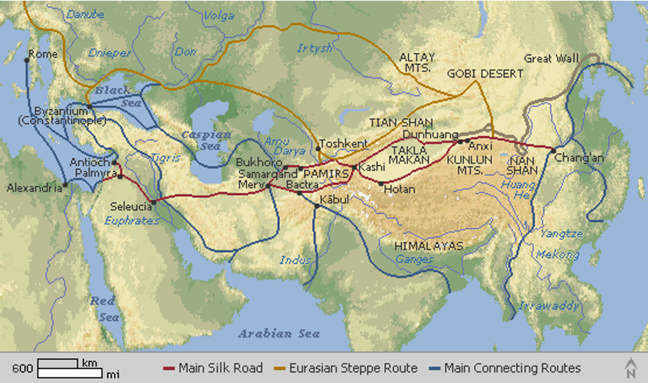
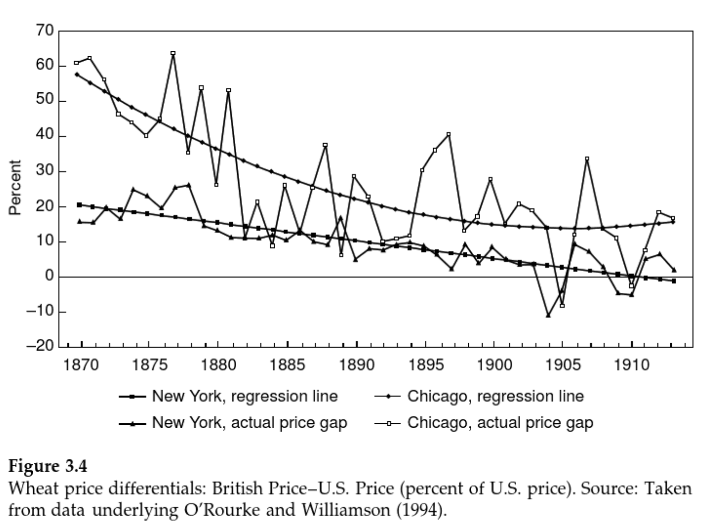
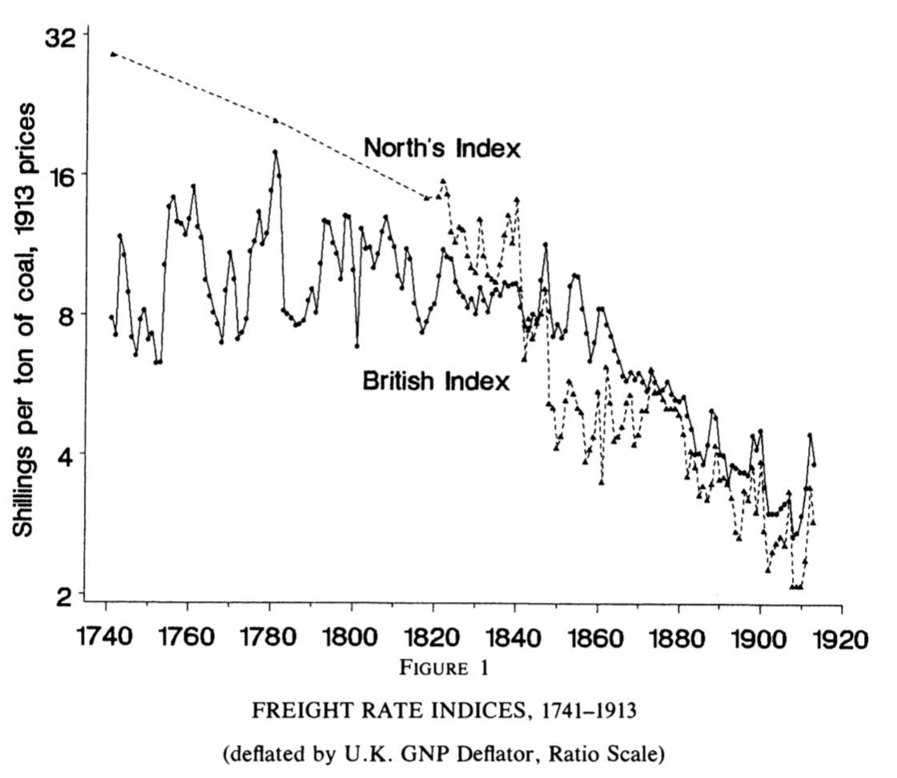
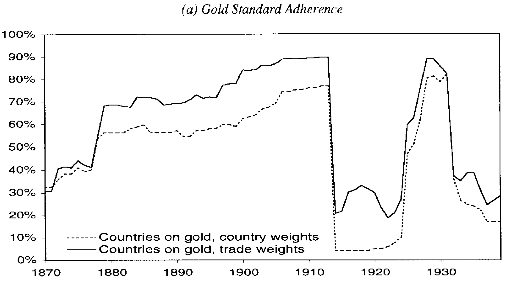
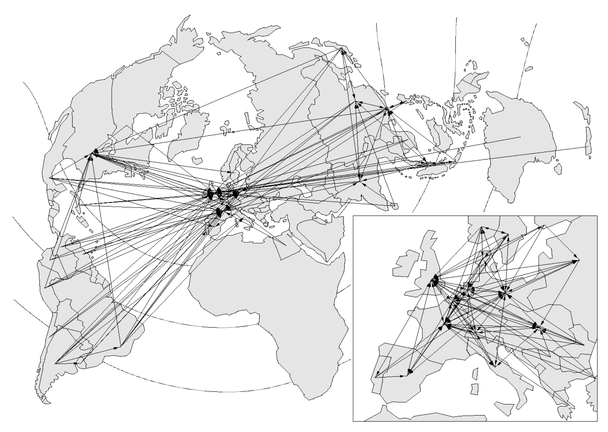
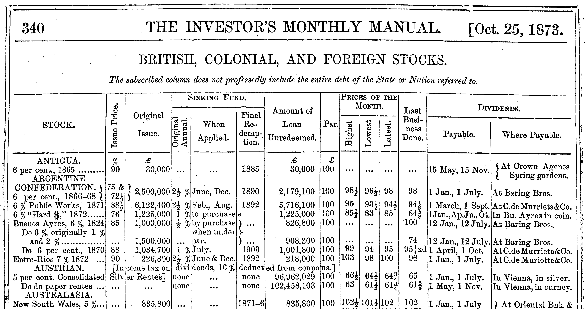
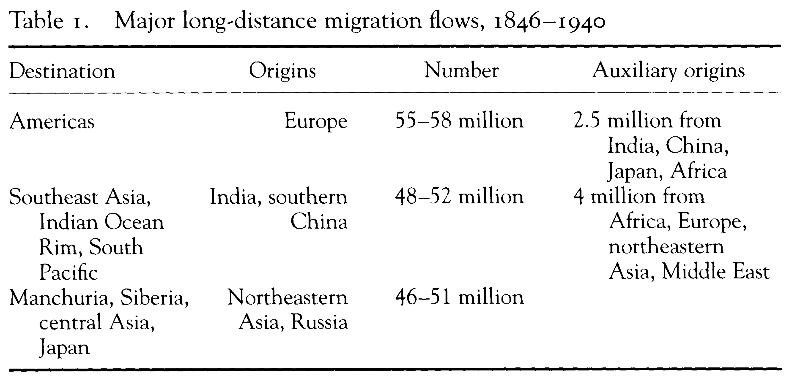
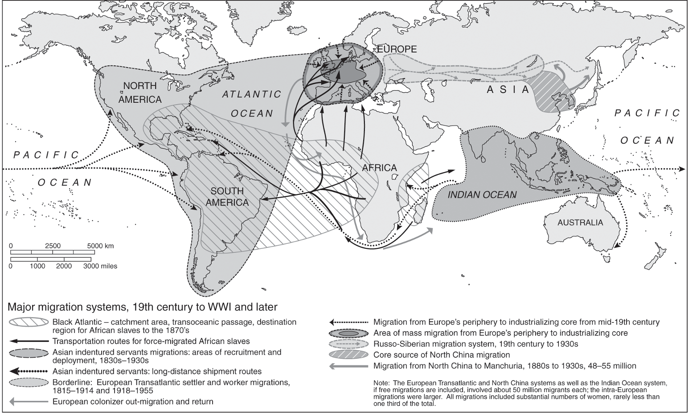
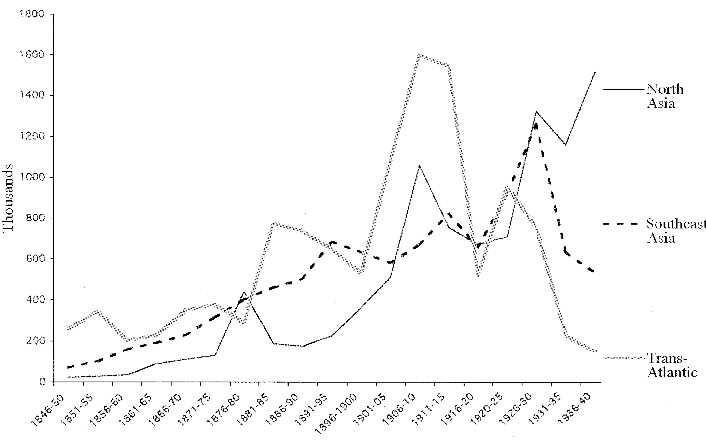
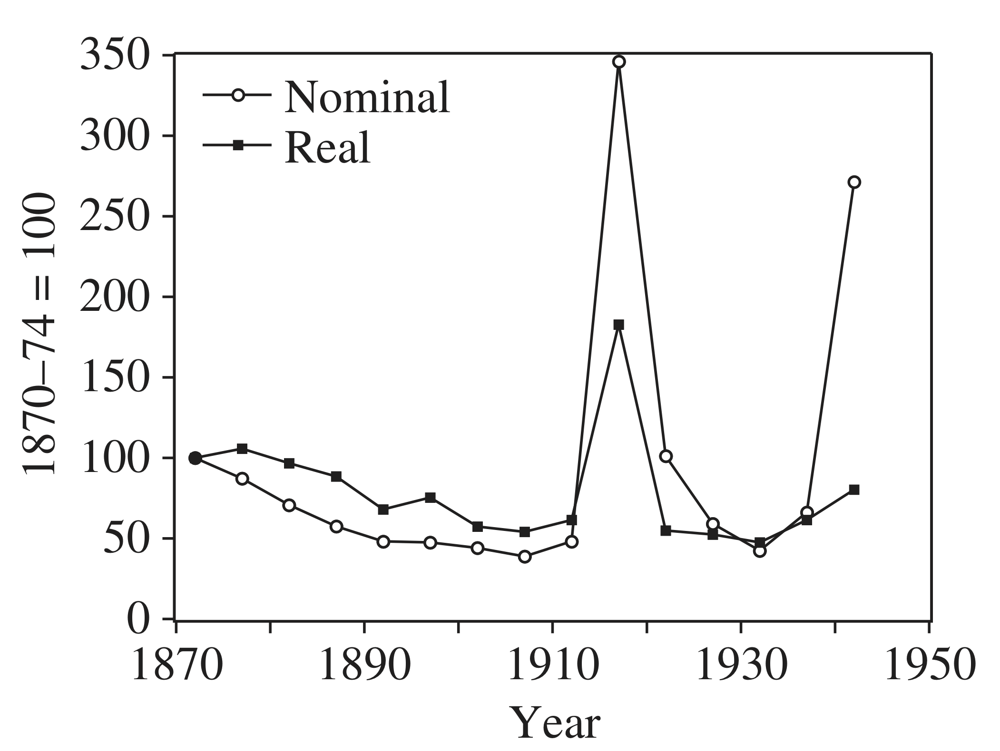

```{r setup, include=FALSE}
knitr::opts_chunk$set(echo = FALSE, message = FALSE, warning = FALSE)
```


```{r xaringan-themer, include = FALSE}
library(xaringanthemer)
style_solarized_light(text_font_google = google_font("Roboto Condensed"),
                      header_font_google = google_font("Roboto Condensed"))
source("helper_functions/theme_lecture.R")
xaringanExtra::use_webcam()
```

# Outline of Today's Lecture

## 1. What and when is globalization?

--

## 2. Commodity Market Integration and Factor Prices

--

## 3. Beyond Commodity Markets and Deglobalization

---

class: inverse, center middle

# Part I

---

## The rise and fall of global economic integration?

.pull-left60[
> What an extraordinary episode in the economic progress of man that age was which came to an end in August, 1914! **…The inhabitant of London could order by telephone, sipping his morning tea in bed, the various products of the whole earth, in such quantity as he might see fit, and reasonably expect their early delivery upon his doorstep; he could at the same moment and by the same means adventure his wealth in the natural resources and new enterprises of any quarter of the world;** …most important of all, he regarded this state of affairs as normal, certain, and permanent, except in the direction of further improvement ...
<br>
 -- John Maynard Keynes, *The Economic Consequences of the Peace* (1919), ch. 2.
]

.pull-right40[

]

---

```{r merch, out.width="100%", fig.retina=3}
library(tidyverse)

trade_dat <- read_csv("merchandise-exports-gdp-cepii.csv")
names(trade_dat) <- c(names(trade_dat)[1:3], "Value")

trade_dat %>% 
  filter(Entity == "World", Year <= 1939, Year >= 1850) %>% 
  ggplot(aes(Year, Value)) + 
  geom_line() +
  geom_point() +
  geom_label(aes(x = 1913, 
                 y = trade_dat %>% 
                   filter(Entity == "World", Year == 1913) %>%  .$Value,
                 label = "1913"), nudge_y = 1) +
  geom_label(aes(x = 1935, 
                 y = trade_dat %>% 
                   filter(Entity == "World", Year == 1935) %>%  .$Value,
                 label = "1935"), nudge_y = -1) +
  ylab("Value of global merchandise exports\nas a share of GDP (%)") +
  xlab("") +
  ylim(c(0,15)) +
  labs(caption = "Source: Fouquin and Hugot; CEPII 2016; National data",
       title = "Global Exports as Share of Global GDP",
       subtitle = "1850-1939") +
  theme_lecture
```

---

## What is globalization?

> "Globalization is clearly a significant native’s category for anyone studying contemporary politics. ...But is it also a useful analytic category? My argument here is that it is not. Scholars who use it analytically risk being trapped in the very discursive structures they wish to analyze." <br> - Cooper, *Colonialism in Question*, p. 93.

--

<br>

> "There are two problems with the concept of globalization, first the “global,” and second the “-ization.” The implication of the first is that a single system of connection ... has penetrated the entire globe, and the implication of the second is that it is doing so now, that this is the global age." <br> - Cooper, *Colonialism in Question*, p. 91.

--

<br>

> "...we  need  to define  terms:  globalisation  is  taken  here  to  mean  the  integration  of  international  commodity  markets." <br> -O'Rourke and Williamson, "When did globalization begin?"

---

## Plausible globalizations

.pull-left[
> "There have been few times in history when the world has been so closely interconnected — not only economically, but also in culture and tradition." <br> - Beatrice Manz cited in Cooper, *Colonialism in Question*, p. 100.

]

.pull-right[

]

### Proponents of earlier globalizations

+ Andre Gunder Frank (before 1500)
+ Janet Abu-Lughod (before 1350)
+ Frank and Gills: "the existence of the same world system in which we live stretches back at least 5,000 years"

.pull.center[**Clearly definitions matter!**]

---

## Plausible globalizations

#### Is connection enough?

> "The discovery of America, and that of a passage to the East Indies by the Cape of Good Hope, are the two greatest and most important events recorded in the history of mankind. ... By uniting, in some measure, the most distant parts of the world, by enabling them to relieve one another's wants, to increase one another's enjoyments, and to encourage one another's industry, their general tendency would seem to be beneficial." <br> 
-Adam Smith, *The Wealth of Nations*, Book 4, ch. 7, part 3.

--

#### Or does scale matter?

> "What remains ... in doubt is the contemporary impact or significance of these new configurations of long-distance trade ... it is far less clear what meaning the new connections had for those who lived in the sixteenth or even the seventeenth century" <br> 
-Tracy, *The Rise of Merchant Empires*, quoted in O'Rourke and Williamson, "When did globalization begin?"

---

## Economic Globalization as price convergence?

> "Thus, *the only irrefutable evidence that globalisation is taking place is a decline in the international dispersion of commodity prices or what might be called commodity price convergence* [Emphasis in original]." <br>
-O'Rourke and Williamson, "When did globalization begin?", p. 26.

--

### Why?

+ A measure of globalization that captures the domestic impact of global forces
+ Changes in trade volumes could just be shifts in supply or demand
+ When trade forces changes in domestic prices it can 'influence things that really matter' like income distribution, living standards, quality of life, etc.

---

## Economic globalization as price convergence?

> "We see no evidence documenting significant pre-nineteenth century global price convergence for the (competing) commodities that really mattered to the economic lives of the vast majority. Nor do we see any evidence of significant commodity price convergence even for those (non-competing) commodities that mattered little to the vast majority. The implications for world history are, we think, revisionist and profound."
<br>
-O'Rourke and Williamson, "When did globalization begin?", p. 28

#### Key questions

+ Why does this occur in 19th century?
+ What drives commodity market integration at scale?
+ What are the forces that produce commodity price convergence?
+ What are the consequences of this kind of globalization?

<br> 
.Large[...Answers in Part II!]

---

class: inverse, center, middle

# Part II

---

## Recall the argument...

> "...trade theory tells us that if a country’s relative commodity prices are little affected... then its consumption, production and factor income distribution will also be little affected. This inference follows regardless of how colorful are the tales of explorers, discoverers, sea battles, plunder, pirates, flows of gold, flows of silver and the immense spice trade profits that fill our history books."<br> -O'Rourke & Williamson, "The Heckscher-Ohlin Model Between 1400 and 2000", p. 3-4

---



.center.pull[Commodity Price Convergence]

---

name: causes_master

## Causes of commodity price convergence

### Transport

+ [The falling cost of transport is a major driver](#transport)

### Gold Standard

+ [Common currency eases payments](#goldstandard)

### Financial Flows

+ [Europe, and in particular Britain, develop enormous investment portfolio that they direct abroad](#portfolio)

---

name: transport



---


[return](#causes_master)

---

name: goldstandard


+ Across the 19th century countries increasingly adopted the gold standard
    - Preferred by investors to insulate against exchange rate shocks
    - Preferred by traders so they do not have to hedge currency risk
+ Gold standard is complicated: **not** just paying people with gold coins
    - notes redeemable for gold, notes redeemable for other notes that are redeemable for gold, etc.
    
---


+ A map showing who is selling the currency of whom on local forex markets (Flandreau and Jobst 2005) [return](#causes_master)

---

name: portfolio



+ Most investment flows into either sovereign debt or major infrastructure projects like railroads
+ These underpin the commodity production!

---

## Consequences of commodity price convergence

+ Factors of production are forced into competition
    - Argentinian farmers vs French farmers, Canadian combine manufacturers vs Australian farm equipment manufacturers, etc. 
+ Places with abundant land can produce grain more cheaply
    - Convergence in global grain prices drives farmers in land-scarce regions out of the market!
    - High wages in settler colonies (Argentina, Australia, Canada...) push European real wages up!
+ This process sometimes called Heckscher-Ohlin theory after a Swedish historian and economist, for more see [Appendix slides](#ho_plus)    
    
> "Less frequently remarked upon, but equally obvious, are the long-run implications for European income distribution. Such an increase in land endowments would inevitably spell disaster for European landowners. Over-all living standards might increase, but in the long run European rents would decline, with European labor or capital benefitting." <br> -O'Rourke, "European Grain Invasion", p. 775

---

.pull-left[
### Land Abundant Exporters

Factors   |  Technology  |  Exports
```{r ho_mermaid}
library(DiagrammeR)

mermaid("
graph LR
A((Abundant Land)) --> D[Production<br>Process]
B((Labor)) --> D
C((Capital)) --> D
D --> E((Agri.<br>Produce))")

```
]

.pull-right[
### Labor Abundant Exporters
Factors   |  Technology  |  Exports
```{r ho_mermaid_2}
library(DiagrammeR)

mermaid("
graph LR
A((Land)) --> D[Production<br>Process]
B((Abundant Labor)) --> D
C((Capital)) --> D
D --> E((Manuf.<br>goods))")

```
]

---

```{r uk_factors, fig.align='center', fig.retina=3, out.width="100%", fig.width=6, fig.height=4.5}
library(tidyverse)
library(ggthemes)

fp <- data.frame(date = seq(1877, 1912, 5),
                 real_wage = c(100, 104,
                               113.9, 118.8,
                               127.6, 121.6,
                               128.8, 125.9),
                 real_land = c(100, 77.3, 76.1, 
                               76.7, 82.2, 69.8,
                               68.3, 58.2))

fp <- fp %>%
  gather("factor", "index", -date) 

fp %>% 
  ggplot(aes(date, index, color=factor)) +
  geom_line() + 
  geom_point()+
  theme_hc() +
  scale_color_hc() +
  guides(color = FALSE) +
  geom_label(data = fp %>% filter(date==1912),
             aes(date, index, color=factor, 
                 label = c("Real Wage", "Real Land Prices"))) +
  xlim(c(1875, 1915)) +
  theme_lecture  +
  ggtitle("Hekscher-Ohlin at Work?", 
          subtitle = "Index of British Land and Labor Prices")

```

---

```{r wage_rent_ratios, fig.align='center',fig.retina=3, out.width="100%", fig.width=6, fig.height=4.5}
library(readxl)
library(ggrepel)

wr <- read_xlsx("wage_rent_ratios.xlsx")

wr <- wr %>% gather("Country", "Index", - Year) %>% 
  mutate(Continent = ifelse(Country %in% c("Australia", "US"), 
                            "New World", "Old World"),
         Policy = ifelse(Country %in% c("France", "Germany"),
                                 "Protectionist", "Open"))

wr %>% 
  ggplot(aes(Year, Index, 
             group = Country, 
             color = Continent, linetype = Policy)) +
  geom_line() + 
  geom_point()+
  theme_hc() +
  scale_color_hc() +
  guides(color = FALSE) +
  geom_label_repel(data = wr %>% filter(Year==1912),
             aes(Year, Index, color=Continent, 
                 label = Country)) +
  xlim(c(1875, 1915)) +
  theme_lecture  +
  ggtitle("Evidence of Convergence in Wage-Rental Ratios?", 
          subtitle = "1877 to 1912")

```

---

## But...

Countries respond differently to the pressures international markets place on them

> "But Argentina and Canada were both reliant on British capital and markets, yet they took demonstrably different paths. It is the internal dynamic -- land tenure, labor relations, infrastructure, and government policies -- that best explains why and how different settler societies responded the way that they did to the global grain market." <br> Topik and Wells, p. 704-5.

+ France vs Britain and agricultural protection

---

class: inverse, center, middle

# Part III

---

## What about migration?



---

### Multiple migration systems



+ We should not privilege Atlantic migration

---

### Migrants motivations

.pull-left[

]

.pull-right[
Ong Ewe Hai (1830-1889): Chinese peddler in Sarawak (N-W of Borneo) in the 1840s; founded limited liability company in 1872 that dominated local shipping, and one of Singapore’s wealthiest men in the 1880s.

> "...serious work [on migration] will be undertaken only once it is clear that global migrations are broadly comparable... Even scholars who are aware of migration beyond the Atlantic tend to characterize it as directly subject to European expansion and not generated by the same impulses that shaped transatlantic migrations." <br>
-McKeown, p. 168

]

---



> "...rather than posing a dichotomy of before and after 1914, it would be better to understand regimes of regulation as part of a cumulative process that had been taking place since at least the 1870s" <br> -McKeown, p. 173.

---

## Deglobalization

### Some questions

+ Was there deglobalization?
+ When was it?
+ Why did it happen?

---

### How much deglobalization?

### As measured by price convergence...

> "the Liverpool–Bombay cotton price gap, which had been 20% in 1913, increased to 102% in 1917; the Liverpool–New Orleans cotton price gap increased from 12% to 43.8%; the London–Calcutta jute price gap rose from 4.4% to 106.8%, the rapeseed price gap rose from 14% to 140%, and the linseed price gap rose from 21.8% to 216.8%; the Hull–Bombay cottonseed price gap rose from 39.9% to 278%; and the London–Rangoon rice price gap increased from 26.5% to an astonishing 422.5%"<br>
-Findlay & O'Rourke, p. 434

.pull-left[
#### WWI ushers in

+ Significant *divergence* in global goods prices
+ Countries did **not** generally become more closed to trade during WWI...
    - But markets became less integrated
]
.pull-right[

]
---

### Economic legacies of WWI

### Non-combatants expand production

+ E.g. Argentine meat exports rise 75%
+ Javan and Cuban sugar boom
+ Non-combatants branch into manufacturing
    - Japanese share of Indian textile market goes from 1% (1913) to 21% (1918)!
    
### Combatants expand industrial capacity

+ E.g. British steel output from 7.7 to 9.5 million tons
+ German metals production +50%

### Results

+ Excess capacity in manuf. and excess production in commodities
+ New lobbies seeking protection
+ Large accumulated debts
+ More countries more trade policies!

---

### Does globalization beget deglobalization?


> "The aim of this essay is to question this common sense view of World War I as disrupting the world economy and putting an end to an era of globalization. ...We offer a narrative sketch of how one might write **a history in which the war figured not as an exogenous shock**, but as a moment of convulsive and violent realignment endogenous to that history. ...what is at stake are **the destabilizing consequences of convergence**, the basic prediction of any neoclassical vision of globalization. ...Being converged upon by Imperial Russia was every bit as unsettling to the powers of Western Europe before 1914, as the rise of China is to the United States today."<br>
-Tooze & Fertik

--

<br>

> "To the extent that the Depression was caused by malfunctioning international capital markets, or the gold standard that was thought at the time to underpin them, we have yet another case of globalization undermining itself, since the Depression was the major cause of interwar protectionism" <br> -O'Rourke, "Economic History and Contemporary Challenges to Globalization", p. 371-2.

---

class: inverse, middle, center

# Appendix 

---

name: ho_plus

## Heckscher and Ohlin

.pull-left[

+ Eli Heckscher
+ Bertil Ohlin
]

.pull-right[

]

---

## Heckscher-Ohlin: Determinants of Trade

> "Australia has a small population and an abundant supply of land, much of it not very fertile. Land is consequently cheap and wages high, in relation to most other countries. It would therefore seem profitable to produce goods requiring large areas of less fertile land but relatively little labour. Such is the case, for example, in wool production. . . . Similarly, regions well endowed with technically trained labor and capital will specialize in industrial production. . . . Exports from one region to the other will on the whole consist of goods that are intensive in those factors with which this region is abundantly endowed and the prices of which are therefore low. . . . In short, commodities that embody large quantities of particularly scarce factors are imported, and commodities intensive in relatively abundant factors are exported. . . . Australia exchanges wool and wheat for industrial products since the former embody much land and little labour while the opposite is true of industrial products. Australian land is thus exchanged for European labor."<br> -Ohlin, 1924 

---

## Heckscher-Ohlin: Determinants of Factor Prices

> "If, for example, Australia produced its own industrial products rather than importing them from Europe and America in exchange for agricultural products, then, on the one hand, the demand for labor would be greater and wages consequently higher, and on the other the demand for land, and therefore rent, lower than at present. At the same time, in Europe the scarcity of land would be greater and that of labor less than at present if the countries of Europe were constrained to produce for themselves all their agricultural products instead of importing some of them from abroad. Thus trade increases the price of land in Australia and lowers it in Europe, while tending to keep wages down in Australia and up in Europe. **The tendency, in other words, is to approach an equalization of the prices of productive factors**."<br> -Ohlin, 1924
